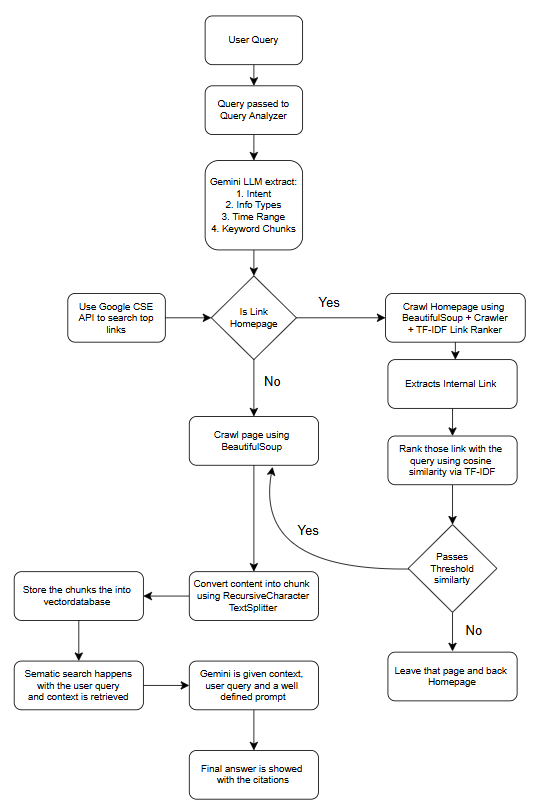

# 🌐 Gemini-Powered RAG Web Research Agent

An intelligent web research assistant that combines Google Gemini, Google CSE API, BeautifulSoup-based scraping, TF-IDF ranking, and Chroma vector store to conduct deep web research and synthesize insights with proper citations.

---

## 🚀 Features

- **Gemini LLM Query Analyzer**: Extracts intent, information types, time ranges, and keyword chunks from user queries.
- **Google CSE Integration**: Uses official API to get highly relevant search results.
- **Homepage Detection + Internal Crawler**: Automatically detects homepage links and crawls subpages.
- **TF-IDF + Cosine Similarity Ranking**: Ranks internal links based on relevance to the user query. Only links with cosine similarity above a threshold (default: **0.3**) are followed.
- **Text Chunking**: Breaks scraped content into manageable pieces using LangChain's `RecursiveCharacterTextSplitter`.
- **Embedding + Storage**: Generates Gemini embeddings and stores in a persistent Chroma vectorstore.
- **Semantic Retrieval + Answer Generation**: Retrieves top-k relevant chunks and uses Gemini to synthesize a comprehensive, well-cited Markdown report.
- **Streamlit UI**: Clean interface with sidebar controls for max links, crawl depth, and page count.

---

## 🔍 How It Works (Flow)

1. **User Inputs Query** in Streamlit UI
2. **Gemini Query Analyzer** extracts search metadata
3. **Google CSE API** fetches links for each keyword chunk
4. If a link is a homepage:
    - Crawl subpages using BeautifulSoup
    - Extract internal links
    - Rank using TF-IDF + Cosine Similarity
    - **Only enqueue links with similarity > 0.3**
5. **Scraped content** is chunked and embedded
6. Chunks are stored in **Chroma vector store**
7. **Retriever pulls top chunks** based on query
8. Gemini LLM generates a **final answer** with citations
---

### 📊 Architecture

For a visual representation of the agent's components and data flow, please refer to the diagram:



---

## 📂 Folder Structure

```bash
WebResearchAgent/
├── app.py                         # Main Streamlit UI app
├── .env                           # Environment variables (API keys)
│
├── agent/
│   ├── config.py                  # API key loader
│   ├── search_tool.py             # Google CSE search wrapper
│   ├── scraper_tool.py            # Page scraper using BeautifulSoup
│   ├── chunker.py                 # LangChain text splitter
│   └── query_analyzer.py          # Gemini-based query analysis
│
├── pipeline/
│   ├── search_and_scrape.py      # Full web scraping + crawling pipeline
│   ├── crawler.py                 # Homepage crawler with TF-IDF ranking
│   ├── link_ranker.py             # TF-IDF cosine similarity scoring
│   ├── embed_and_store.py        # Embedding chunks to Chroma
│   ├── query_handler.py          # Unified handler for analyzer
│   └── answer_generator.py  
│
├── docs/                         # Documentation and diagrams
│   ├── architecture.png          # Visual representation of the agent's architecture
│   └── design_notes.md           # Notes on design decisions and architecture
│
└── tests/                        # Unit and integration tests
    ├── __init__.py
    ├── test_query_analyzer.py
    ├── test_scraper_tool.py
    └── test_search_tool.py     # Gemini-based RAG answer generator
```

---

## ⚙️ Installation

```bash
git clone https://github.com/Shiv1909/WebScraping-Agent.git
cd WebResearchAgent
pip install -r requirements.txt
```

Set your `.env`:
```bash
GOOGLE_CSE_API_KEY=your_key
GOOGLE_CSE_CX=your_cx_id
GEMINI_API_KEY=your_gemini_key
```

---

## 🚪 Run the App

```bash
streamlit run app.py
```

---

## 🔍 Example Use Cases
- Competitive pricing comparisons
- Government policy tracking
- Tech product launches
- Event timeline reports

---

## 🎓 Built With
- [Google Gemini](https://ai.google.dev/)
- [Google CSE API](https://programmablesearchengine.google.com/)
- [LangChain](https://www.langchain.com/)
- [ChromaDB](https://www.trychroma.com/)
- [BeautifulSoup](https://www.crummy.com/software/BeautifulSoup/)

---

## 🙏 Acknowledgements
Thanks to OpenAI, Google, LangChain, and the open-source ecosystem.

---

## 🚩 License
MIT License

